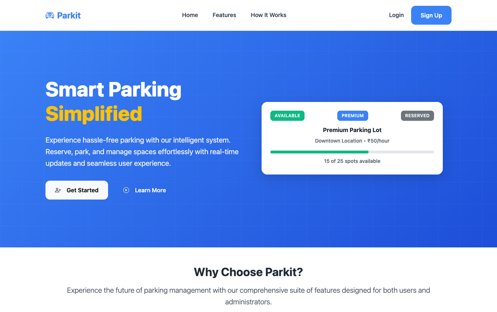

<h1 align="center">Parkit</h1>

<p align="center">A vehicle parking app for 4-wheelers. Drivers book a spot in a parking lot and pay by the hour. An admin manages the lots and sees which car is parked where.</p>

**Live demo:** https://parkitapp.vercel.app
**Source:** https://github.com/theshivam7/Parkit

| | |
|---|---|
| Program | IIT Madras BS in Data Science, Diploma level |
| Course | Modern Application Development I - Project ([BSCS2003P](https://study.iitm.ac.in/ds/course_pages/BSCS2003P.html)), 2 credits |
| Theory course | Modern Application Development I ([BSCS2003](https://study.iitm.ac.in/ds/course_pages/BSCS2003.html)), 4 credits |
| Problem statement | [Vehicle Parking App - V1](https://docs.google.com/document/u/3/d/e/2PACX-1vR9h1TDBhntxl1XA3tWalsCSVw_tqw8dUZ6TtXotYHwfAmtC_GHDTCq_NakeJuP_EKQFR2JIubjnmiH/pub) (May 2025 term) |
| Project guidelines | [MAD I project document](https://docs.google.com/document/u/3/d/e/2PACX-1vQXZXcz4tZukKB1SY1YgFBwQsc_gAgfr822JmzvhJMnOC-kc1mXzyguVmWoOtXpykO1spBO8VHsEVap/pub) |
| Grade | B |

## Demo logins

| Role | Email | Password |
|---|---|---|
| Admin | `admin@parkit.com` | `admin@123` |
| User | `demo@parkit.com` | `demo1234` |

## Screenshot



## Features

**Users**
- Search lots by name or PIN code and see free spots and price
- Book a spot (the first free one is assigned), then release it when leaving
- Live parking time and cost, booking history, and a spend chart

**Admin**
- Create, edit, and delete lots. Spots are created to match the lot size
- Spot map for each lot, showing which vehicle is parked where
- Search reservations by vehicle number, user, or lot. Export as CSV
- Occupancy and revenue charts, and a list of users

Billing: you pay for the booked hours, plus a full hour for every extra hour or part of one.

## Tech stack

      

This is the stack the course requires. SQLite is created by the app on first run.

## Run it locally

```bash
git clone https://github.com/theshivam7/Parkit.git
cd Parkit
python -m venv .venv
source .venv/bin/activate
pip install -r requirements.txt
python app.py
```

Open http://127.0.0.1:5001. The first run creates `instance/database.db` with the admin, a demo user, three lots, and some past bookings. Delete that file to start fresh.

## Deploy on Vercel

Import the repo in Vercel (it finds the Flask `app` in `app.py`) and deploy. Set a `SECRET_KEY` environment variable.

The course requires SQLite, and Vercel can only write to `/tmp`, which resets now and then. So the live demo returns to the demo data from time to time.

## JSON API

| Endpoint | Who | Returns |
|---|---|---|
| `GET /api/stats` | Admin | Counts of lots, spots, occupied spots, users, active bookings |
| `GET /api/current-booking` | User | Your active booking: elapsed time, running cost, end time |

## Author

[Shivam Sharma](https://www.linkedin.com/in/theshivam7/)
